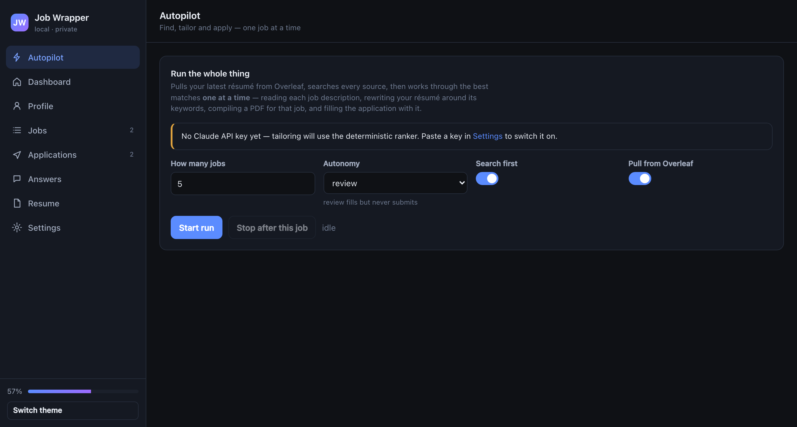
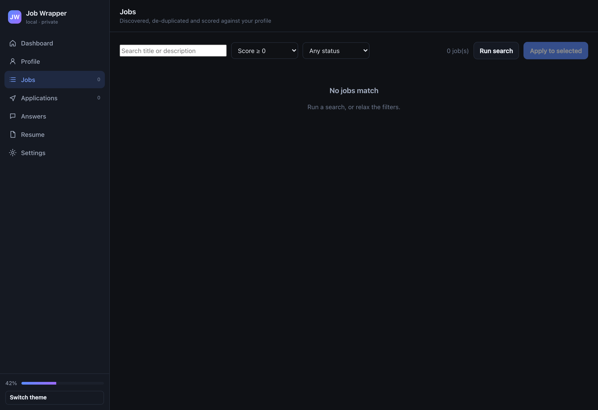

# Job Wrapper

Find jobs across the internet, tailor your résumé to each one, and fill in the applications —
with a truthfulness firewall in front of the résumé writer and a human in front of the submit
button.

Two editions, one brain:

| | **V1 — Aggregator** | **V2 — Plugin** |
|---|---|---|
| What it does | Searches 19 job sources, de-duplicates, scores, tailors, applies | Works on the company career page you are already on |
| Where it runs | Python CLI + Playwright + a local web UI | Chrome/Edge MV3 extension |
| Job discovery | 19 adapters (Greenhouse, Lever, Ashby, Workday, …) | none — the page in front of you |
| Résumé tailoring | in-process | via the local companion server |
| Form filling | Playwright, 9 ATS adapters | the DOM, same knowledge base |
| Submits for you | only at `autonomy: auto`, within caps | never — it fills, you submit |

<p align="center"><em>Everything runs on your machine. Nothing is uploaded anywhere except the
job boards you are applying to.</em></p>

---

## What it actually does

```
  your profile ─┐
                ├──▶ 19 sources ──▶ dedupe ──▶ score 0-100 ──▶ shortlist
  search config ┘                                                  │
                                                                   ▼
                                   ┌─────────── per job ───────────────────┐
                                   │ extract JD keywords                    │
  master résumé (Overleaf .tex) ──▶│ tailor: reorder · reweight · rephrase  │
                                   │ TRUTHFULNESS FIREWALL                  │
                                   │ render LaTeX ▶ compile ▶ ATS lint      │
                                   │ open form ▶ resolve 109 field types    │
                                   │ answer what's left ▶ fill ▶ screenshot │
                                   └───────────────┬───────────────────────┘
                                                   ▼
                                     review queue  /  submit  /  ask me
```

**The truthfulness firewall** is the part that matters. The tailor may re-order, re-weight and
re-phrase what your master résumé already says. It may not add a skill, employer, degree, date or
metric that is not in there. Every generated résumé is diffed against the master, and in `strict`
mode any unsupported claim is reverted before a PDF is compiled — whether it came from the model
or from the deterministic ranker.

---

## Install

Requires Python 3.11+. [uv](https://docs.astral.sh/uv/) is the easy path.

```bash
git clone https://github.com/piyushrajput0/job-wrapper.git
cd job-wrapper
uv sync
uv run playwright install chromium
uv run jobwrapper init
```

`init` creates `~/.jobwrapper/`, writes a default config, and opens the web UI.

### Your Claude API key

Paste it into **Settings → Claude API key** in the web UI, or run `jobwrapper key`. It is
encrypted at rest in `~/.jobwrapper/vault.enc` (AES-256-GCM, key in your macOS keychain), never
written to the config file, and never logged. `ANTHROPIC_API_KEY` in the environment still works
and takes precedence. There is a **Test** button that makes one tiny call so you can confirm it
works before a real run.

With a key: the model reads each job description, plans the résumé rewrite, and answers the
awkward free-text questions. Without one: a deterministic ranker does the tailoring and a
template writes the cover letter — blunter, but it never blocks you.

Optional:

```bash
brew install tectonic                 # real LaTeX output; otherwise PDFs render via Chromium
```

Everything works without both. With no API key the tool uses a deterministic ranker and a
template cover letter; with no LaTeX it prints the HTML résumé template to PDF with the Chromium
that Playwright already installed.

---

## Quickstart

```bash
uv run jobwrapper ui                          # fill in your profile (14 sections, 174 fields)
uv run jobwrapper key                         # paste your Claude API key (stored encrypted)
uv run jobwrapper resume import ~/resume.tex  # or: jobwrapper resume overleaf-pull
uv run jobwrapper sources add https://stripe.com/jobs   # detects the ATS automatically
uv run jobwrapper run --limit 5               # ← the whole loop, one job at a time
```

`run` is the one command that does everything:

```
pull your latest résumé from Overleaf
  ▶ search every source ▶ de-duplicate ▶ score against your profile
  ▶ shortlist what clears the floor and has not been applied to
  ▶ then, one job at a time:
        read the job description → pull out its keywords
        → rewrite your résumé around them (truthfulness firewall)
        → compile a PDF for that job
        → open the application → fill it with that PDF
        → stop for your review (or submit, at autonomy `auto`)
     … pause, next job
```

The same run is a button on the **Autopilot** page of the web UI, with a live log of what it is
doing to which job, and a stop button that finishes the job in flight and halts.



Step-by-step instead, if you prefer:

```bash
uv run jobwrapper search                      # fetch, dedupe, score
uv run jobwrapper list --min-score 70
uv run jobwrapper apply --limit 3             # fills everything, stops before submit
uv run jobwrapper status
```



---

### Reviewing what it filled

At `review` the run fills each form and then ends — which closes the browser and takes the
filled form with it. The fill plan is stored, so putting it back is one command (or the
**Open & refill** button on the Applications page):

```bash
uv run jobwrapper review          # the oldest one waiting
uv run jobwrapper review --all    # work through all of them
```

It re-opens the posting in a visible browser, replays the exact values you already reviewed —
no re-tailoring, no model call — and waits while you check it, attach anything the page still
needs, and press submit yourself. Answer the prompt and it records the outcome.

## The three autonomy levels

| Level | What happens | Use it when |
|---|---|---|
| `dryrun` | Opens the form, works out what it *would* fill, writes a plan. Types nothing. | You are checking coverage on a new ATS |
| `review` **(default)** | Fills every field, screenshots each step, stops at the submit button | Always, until you trust it |
| `auto` | Submits too — subject to the daily cap, per-company cap and match-score floor | You have watched it work and want volume |

At every level it will **stop and hand you the browser** rather than solve a CAPTCHA, answer an
MFA prompt, guess at a criminal-history question, or type a national ID number.

---

## What it knows how to answer

The intake covers the long tail that actually blocks applications — see
[`docs/03-APPLICATION-DATA.md`](docs/03-APPLICATION-DATA.md) for the research behind it:

- identity, contact, full postal address, 13 profile links
- **work authorisation per country** — the "authorized to work?" / "require sponsorship?" pair
  that has to stay consistent, visa status, permit expiry
- education including **minor**, second major, GPA *and its scale*, expected graduation
- experience with per-role technologies, supervisor, "may we contact them?"
- compensation, notice period, relocation, travel, work-model preference
- the recurring screeners (over 18, background check, clearance, non-compete, previously applied)
- **voluntary self-identification** (gender, race, veteran, disability CC-305) — off by default,
  every field set to decline unless you opt in
- "how did you hear about us?" with per-company referral overrides

Anything it still cannot answer is asked **once**, then remembered in the answer bank and never
asked again.

---

## The browser extension (V2)

For company career sites that no aggregator indexes.

1. `uv run jobwrapper ui` → Settings → copy the extension token
2. `chrome://extensions` → Developer mode → **Load unpacked** → pick `extension/`
3. Paste the token in the extension's options page, hit **Sync profile**

On any posting you get a floating panel: match score with reasons, JD keywords colour-coded by
whether your résumé can back them, a one-click tailored PDF, and a form scan that shows exactly
what it will type before it types it. It never presses submit. If the companion server is not
running it falls back to a cached profile and the same resolver, compiled to JavaScript — a
[parity test](tests/test_parity.py) asserts the two implementations agree field-for-field.

---

## Sources

**Per-company ATS boards** (official public APIs): Greenhouse, Lever, Ashby, Workable,
SmartRecruiters, Recruitee, Personio, Breezy, Workday.
**Aggregators**: RemoteOK, Remotive, Arbeitnow, Jobicy, Himalayas, The Muse, Adzuna (free key),
USAJOBS (free key), Hacker News "Who is hiring?".
**Any careers page**: `jobwrapper sources add <url>` sniffs the ATS and board token out of the
page and wires up the right adapter.

LinkedIn, Indeed and Glassdoor are deliberately **not** scraped — their terms forbid it and
automating a logged-in session risks your account. The extension is the sanctioned way to work a
page you opened yourself. See [`docs/06-COMPLIANCE.md`](docs/06-COMPLIANCE.md).

---

## Commands

```
jobwrapper init | ui | doctor | profile | key
jobwrapper run [--limit N] [--autonomy review|auto|dryrun] [--no-search] [--no-overleaf]
jobwrapper search [--source ID] | list [--min-score N] | show <job-id>
jobwrapper apply [--job ID] [--limit N] [--autonomy dryrun|review|auto]
jobwrapper review [<application-id>] [--all]
jobwrapper status | export --what jobs|applications
jobwrapper resume import <file> | tailor <job-id> | overleaf-auth | overleaf-pull
jobwrapper sources list | add <careers-url> | kinds
jobwrapper answers list | set <q> <a> | forget <q>
jobwrapper vault list | set <domain> <username>
```

---

## Layout

```
src/jobwrapper/
  models/      profile (174 fields) · job · application · résumé
  store/       SQLite: jobs, applications, answer bank, artifacts, audit log
  sources/     19 job-source adapters + career-page ATS sniffing
  pipeline/    normalise · dedupe · explainable 0-100 match score
  resume/      import · keywords · tailor + firewall · render · compile · ATS lint · Overleaf
  autofill/    field catalog · resolution cascade · answer engine
  apply/       Playwright driver · 9 ATS adapters · the run loop
  server/      FastAPI companion API + the local web UI
  data/        the shared knowledge base (JSON) - one source of truth for both editions
extension/     MV3 extension, no build step, bundles the same data/
docs/          the spec, ATS research, application-data research, compliance
```

Documentation: [spec & design decisions](docs/00-SPEC.md) ·
[architecture](docs/01-ARCHITECTURE.md) · [ATS research](docs/02-ATS-RESEARCH.md) ·
[what applications ask](docs/03-APPLICATION-DATA.md) ·
[résumé pipeline](docs/04-RESUME-PIPELINE.md) · [extension](docs/05-EXTENSION.md) ·
[compliance](docs/06-COMPLIANCE.md)

---

## Development

```bash
uv run pytest -q                              # 70 tests
uv run pytest -m parity                       # V1 ↔ V2 resolver equivalence (needs a browser)
uv run ruff check src tests
uv run python scripts/build_field_catalog.py  # regenerate the field catalog
uv run python scripts/sync_extension_data.py  # push the knowledge base into the extension
```

Teaching it a new field is a one-line edit in `scripts/build_field_catalog.py`, then
`sync_extension_data.py` — both editions learn it at once.

---

## Honest limitations

- Workday's wizard is the hardest flow and the most likely to need you mid-run.
- Taleo is marked assisted-only: the tool advises, you drive.
- File uploads cannot be automated from the extension — browsers forbid it. V1 (Playwright) can.
- Deterministic tailoring without an API key is real but blunter than the model path.
- Aggregator feeds go stale; per-company ATS boards are always fresher. Postings that have
  since closed are detected, skipped and marked, before any résumé is written for them.
- A résumé imported from a PDF loses structure that the LaTeX source keeps. Point it at the
  `.tex` when you have one.

## License

MIT.
