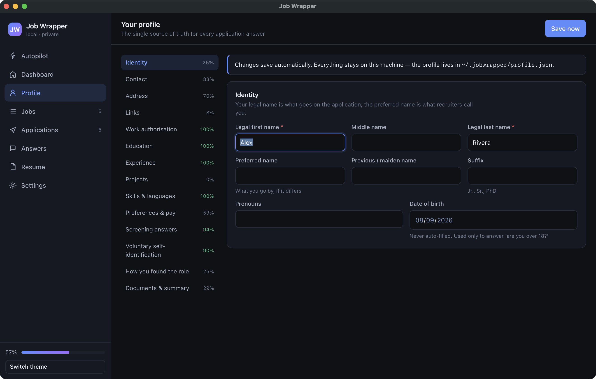
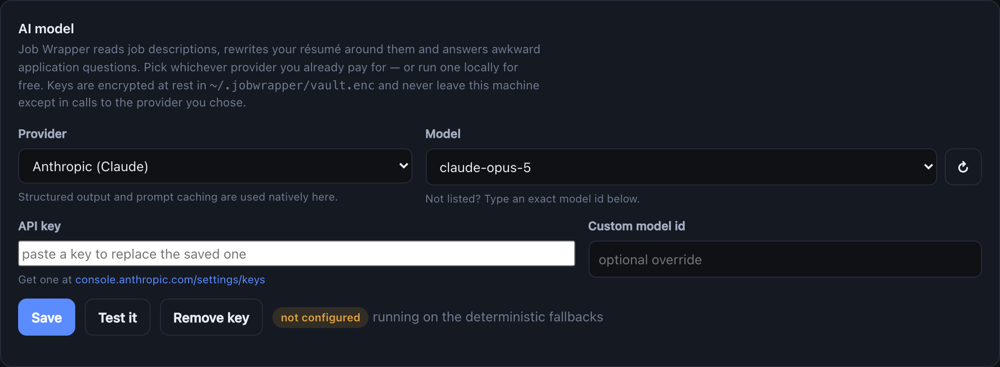

<div align="center">

# Job Wrapper

**Find jobs. Tailor your résumé to each one. Fill in the applications.**

A truthfulness firewall in front of the résumé writer, and a human in front of the submit button.

[](https://github.com/piyushrajput0/job-wrapper/actions/workflows/ci.yml)
[](https://www.python.org/downloads/)
[](LICENSE)
[](tests/)

*Everything runs on your machine. Nothing is uploaded anywhere except the job boards you apply to.*

</div>

---

## Two editions, one brain

| | **V1 — Aggregator** | **V2 — Plugin** |
|---|---|---|
| What it does | Searches job sources, de-duplicates, scores, tailors, applies | Works on the career page you are already on |
| Where it runs | Python CLI + Playwright + a local web UI | Chrome/Edge MV3 extension |
| Job discovery | 19 adapters (Greenhouse, Lever, Ashby, Workday, …) | none — the page in front of you |
| Résumé tailoring | in-process | via the local companion server |
| Model | any of 10 providers, or none | same choice |
| Form filling | Playwright, 9 ATS adapters | the DOM, same knowledge base |
| Submits for you | only at `autonomy: auto`, within caps | never — it fills, you submit |

A [parity test](tests/test_parity.py) asserts the Python and JavaScript resolvers agree
field-for-field, so both editions answer a form the same way.

---

## Quick start

> **New here?** The [Setup](#setup) section below explains every prerequisite from scratch.
> If you already have `git` and [`uv`](https://docs.astral.sh/uv/), this is the whole thing:

```bash
git clone https://github.com/piyushrajput0/job-wrapper.git
cd job-wrapper
uv sync
uv run playwright install chromium
uv run jobwrapper doctor          # confirms the install before you rely on it
uv run jobwrapper ui              # opens the web UI
```

No API key is needed to start. No LaTeX is needed to start. Both are optional upgrades.

---

## Setup

### 1. Prerequisites

<table>
<tr><th>What</th><th>Why</th><th>Install</th></tr>
<tr>
<td><b>Python 3.11+</b></td>
<td>The whole thing is Python</td>
<td>

```bash
# macOS
brew install python@3.12
# Ubuntu / Debian
sudo apt install python3.12
# Windows — or python.org
winget install Python.Python.3.12
```

</td>
</tr>
<tr>
<td><b>uv</b></td>
<td>Installs dependencies and runs commands. Handles the Python version for you.</td>
<td>

```bash
# macOS / Linux
curl -LsSf https://astral.sh/uv/install.sh | sh
# Windows (PowerShell)
powershell -c "irm https://astral.sh/uv/install.ps1 | iex"
```

</td>
</tr>
<tr>
<td><b>git</b></td>
<td>To clone the repo</td>
<td>

```bash
# macOS (ships with Xcode tools)
xcode-select --install
# Ubuntu / Debian
sudo apt install git
# Windows
winget install Git.Git
```

</td>
</tr>
</table>

You do **not** need Node.js. The web UI and the extension have no build step.

### 2. Install

```bash
git clone https://github.com/piyushrajput0/job-wrapper.git
cd job-wrapper
uv sync                              # creates .venv and installs everything
uv run playwright install chromium   # ~150 MB browser used to fill forms
```

`uv sync` reads the committed `uv.lock`, so you get the exact dependency versions CI tests
against.

### 3. Check it worked

```bash
uv run jobwrapper doctor
```

```
╭─────────────────────────────── doctor ───────────────────────────────╮
│  ✓  browser  chromium ready                                          │
│  ✓  pdf      no LaTeX found - falling back to the HTML renderer      │
│  ✗  claude   no key - deterministic fallbacks in use                 │
│  ✗  profile  42% complete, missing: ...                              │
│  ✗  resume   not imported yet                                        │
│  ✓  sources  6 enabled                                               │
╰──────────────────────────────────────────────────────────────────────╯
```

**Those ✗ marks are expected on a fresh install** — they are a to-do list, not errors. A ✗ on
`claude`, `pdf` or `resume` never blocks a run; the tool degrades to a deterministic path instead.
Only a ✗ on `browser` needs fixing before you can apply to anything.

### 4. Tell it about you

```bash
uv run jobwrapper ui
```

The UI opens at `http://127.0.0.1:8787`. You can fill the profile by hand — or let your résumé
do it:

> **Résumé → Profile autofill.** Go to **Résumé → Choose file…**, pick your `.tex` (or `.pdf`,
> `.json`, `.md`, `.txt`), tick *fill my profile too*, and press **Import**. It reads your name,
> contact, full postal address, links, work history, education (including **minor**, GPA **and
> its scale**), projects, spoken languages, and every skill with the years of evidence behind it.
> Typically fills 20+ fields in one go. **Anything you have already answered is left alone** — it
> fills blanks, it does not overwrite you.

Prefer the terminal?

```bash
uv run jobwrapper resume import ~/resume.tex
```

### 5. Optional upgrades

<details>
<summary><b>Pick a model (optional — improves tailoring)</b></summary>

<br>

**Settings → AI model** in the UI, or:

```bash
uv run jobwrapper model --provider anthropic     # or openai / groq / ollama / openrouter ...
```

| Provider | Note |
|---|---|
| Anthropic (Claude) · OpenAI · Google Gemini | the ones most people already pay for |
| Groq · DeepSeek · Mistral · xAI · Together | cheaper or faster, same interface |
| **OpenRouter** | one key, hundreds of models — the picker lists all of them live |
| **Ollama** | runs on your machine. No key, no cost, nothing leaves the laptop |

The model list is **fetched from the provider** when you open the picker, so it is never a stale
hard-coded list. Anything not listed can be typed in as a custom model id.

Keys are encrypted at rest in `~/.jobwrapper/vault.enc` (AES-256-GCM, passphrase in your OS
keychain), never written to the config file and never logged. The matching environment variable
(`ANTHROPIC_API_KEY`, `OPENAI_API_KEY`, `GROQ_API_KEY`, …) still works and takes precedence.
**Test it** makes one tiny call so you can confirm the setup before a real run.

With no model configured, a deterministic ranker does the tailoring and a template writes the
cover letter — blunter, but it never blocks you and it costs nothing.

</details>

<details>
<summary><b>Install a LaTeX engine (optional — but it is what makes the PDF look like your résumé)</b></summary>

<br>

```bash
# macOS
brew install tectonic
# Ubuntu / Debian
sudo apt install texlive-latex-recommended latexmk
# Windows
winget install TeXstudio.TeXstudio     # or MiKTeX
```

Without one, PDFs are rendered by printing an HTML template through the Chromium that Playwright
already installed. That output is valid and ATS-parseable — it just **does not look like your
Overleaf template**. If you care how your résumé looks, install Tectonic.

Job Wrapper looks for `tectonic`, `latexmk`, `pdflatex` and `xelatex` on your `PATH` *and* in the
places installers actually put them (`/opt/homebrew/bin`, `/usr/local/bin`, `/Library/TeX/texbin`,
TeX Live, `~/.cargo/bin`) — because an app launched from Finder or the Start menu does not inherit
your shell's `PATH`.

</details>

<details>
<summary><b>Run it as a real desktop app (optional)</b></summary>

<br>

```bash
uv run jobwrapper app          # native window, no terminal, no browser tab
```

Or build something you can keep in the Dock:

```bash
uv sync --extra desktop
uv run python scripts/build_app.py
mv "dist/Job Wrapper.app" /Applications/
```

The server runs inside the app on a private port; closing the window shuts everything down.



</details>

---

## Using it

```bash
uv run jobwrapper run --limit 5      # ← the whole loop, one job at a time
```

```
pull your latest résumé from Overleaf
  ▶ search every source ▶ de-duplicate ▶ score against your profile
  ▶ shortlist what clears the floor and has not been applied to
  ▶ then, one job at a time:
        read the job description → pull out its keywords
        → rewrite your résumé around them (truthfulness firewall)
        → compile a PDF for that job
        → open the application → fill it with that PDF
        → stop for your review (or submit, at autonomy `auto`)
     … pause, next job
```

The same run is a button on the **Autopilot** page, with a live log and a stop button that
finishes the job in flight and halts.


Step-by-step instead, if you prefer:

```bash
uv run jobwrapper search                    # fetch, dedupe, score
uv run jobwrapper list --min-score 70
uv run jobwrapper apply --limit 3           # fills everything, stops before submit
uv run jobwrapper status
```


### Reviewing what it filled

At `review` the run fills each form and then ends — which closes the browser and takes the filled
form with it. The fill plan is stored, so putting it back is one command (or the **Open & refill**
button on the Applications page):

```bash
uv run jobwrapper review          # the oldest one waiting
uv run jobwrapper review --all    # work through all of them
```

It re-opens the posting in a visible browser, replays the exact values you already reviewed — no
re-tailoring, no model call — and waits while you check it, attach anything the page still needs,
and press submit yourself.

### The three autonomy levels

| Level | What happens | Use it when |
|---|---|---|
| `dryrun` | Opens the form, works out what it *would* fill, writes a plan. Types nothing. | You are checking coverage on a new ATS |
| `review` **(default)** | Fills every field, screenshots each step, stops at the submit button | Always, until you trust it |
| `auto` | Submits too — subject to the daily cap, per-company cap and match-score floor | You have watched it work and want volume |

At every level it will **stop and hand you the browser** rather than solve a CAPTCHA, answer an
MFA prompt, guess at a criminal-history question, or type a national ID number.

---

## The truthfulness firewall

This is the part that matters.

The tailor may re-order, re-weight and re-phrase what your master résumé already says. It may
**not** add a skill, employer, degree, date or metric that is not in there. Every generated résumé
is diffed against the master, and in `strict` mode any unsupported claim is reverted before a PDF
is compiled — whether it came from the model or from the deterministic ranker.

What it *will* do is surface what you have already earned. A tool you described in a bullet but
never listed under Skills is invisible to an ATS keyword scan; that term gets promoted into your
skills list and into the relevant project's technology line. A term your résumé cannot support is
refused at every truthfulness setting.

```
your profile ─┐
              ├──▶ 19 adapters ──▶ dedupe ──▶ score 0-100 ──▶ shortlist
search config ┘                                                  │
                                                                 ▼
                                 ┌─────────── per job ───────────────────┐
                                 │ extract JD keywords                    │
master résumé (Overleaf .tex) ──▶│ tailor: reorder · reweight · rephrase  │
                                 │ TRUTHFULNESS FIREWALL                  │
                                 │ render LaTeX ▶ compile ▶ ATS lint      │
                                 │ open form ▶ resolve 109 field types    │
                                 │ answer what's left ▶ fill ▶ screenshot │
                                 └───────────────┬───────────────────────┘
                                                 ▼
                                   review queue  /  submit  /  ask me
```

---

## What it knows how to answer

The intake covers the long tail that actually blocks applications — see
[`docs/03-APPLICATION-DATA.md`](docs/03-APPLICATION-DATA.md) for the research behind it:

- identity, contact, full postal address, 13 profile links
- **work authorisation per country** — the "authorized to work?" / "require sponsorship?" pair
  that has to stay consistent, visa status, permit expiry
- education including **minor**, second major, GPA *and its scale*, expected graduation
- experience with per-role technologies, supervisor, "may we contact them?"
- compensation, notice period, relocation, travel, work-model preference
- the recurring screeners (over 18, background check, clearance, non-compete, previously applied)
- **voluntary self-identification** (gender, race, veteran, disability CC-305) — off by default,
  every field set to decline unless you opt in
- "how did you hear about us?" with per-company referral overrides

Anything it still cannot answer is asked **once**, then remembered in the answer bank and never
asked again.



---

## The browser extension (V2)

For company career sites that no aggregator indexes.

1. `uv run jobwrapper ui` → **Settings** → copy the extension token
   *(it is also printed in the terminal when the server starts)*
2. `chrome://extensions` → **Developer mode** → **Load unpacked** → pick the `extension/` folder
3. Paste the token in the extension's options page → **Sync profile**

On any posting you get a floating panel: match score with reasons, JD keywords colour-coded by
whether your résumé can back them, a one-click tailored PDF, and a form scan that shows exactly
what it will type before it types it. It never presses submit. If the companion server is not
running it falls back to a cached profile and the same resolver, compiled to JavaScript.

> File uploads cannot be automated from an extension — browsers forbid it. V1 (Playwright) can.

---

## Sources

**19 adapters are implemented; 6 aggregators are enabled by default** so your first search returns
something immediately. Enable the rest, or add your own company boards, in **Settings → Sources**
or with `jobwrapper sources add`.

| | |
|---|---|
| **Enabled by default** | RemoteOK, Remotive, Arbeitnow, Jobicy, Himalayas, The Muse |
| **Available, needs enabling** | Hacker News "Who is hiring?" |
| **Available, needs a free key** | Adzuna, USAJOBS |
| **Per-company ATS boards** (official public APIs) | Greenhouse, Lever, Ashby, Workable, SmartRecruiters, Recruitee, Personio, Breezy, Workday |
| **Any careers page** | `jobwrapper sources add <url>` sniffs the ATS and board token out of the page and wires up the right adapter |

If a search returns fewer jobs than you expected, the run tells you whether your **search terms**
were the bottleneck rather than the scraper:

```
846 fetched · 806 after dedupe · 33 new · 0 updated · 14 filtered out · 759 off target
  most postings never matched your titles or keywords - widen them in Settings
```

LinkedIn, Indeed and Glassdoor are deliberately **not** scraped — their terms forbid it and
automating a logged-in session risks your account. The extension is the sanctioned way to work a
page you opened yourself. See [`docs/06-COMPLIANCE.md`](docs/06-COMPLIANCE.md).

---

## Commands

```
jobwrapper app | init | ui | doctor | profile | model [--show]
jobwrapper run [--limit N] [--autonomy review|auto|dryrun] [--no-search] [--no-overleaf]
jobwrapper search [--source ID] | list [--min-score N] | show <job-id>
jobwrapper apply [--job ID] [--limit N] [--autonomy dryrun|review|auto]
jobwrapper review [<application-id>] [--all]
jobwrapper status | export --what jobs|applications
jobwrapper resume import <file> | tailor <job-id> | overleaf-auth | overleaf-pull
jobwrapper sources list | add <careers-url> | kinds
jobwrapper answers list | set <q> <a> | forget <q>
jobwrapper vault list | set <domain> <username>
```

`jw` works as a shorthand for `jobwrapper`.

### Where your data lives

Everything is in `~/.jobwrapper/` — `config.yaml`, `profile.json`, `jobwrapper.db` (SQLite),
`vault.enc`, and `artifacts/` with every résumé and screenshot it has produced. Nothing leaves
your machine.

Set `JOBWRAPPER_HOME` to use a different directory — handy for keeping separate profiles, or for
trying things out without touching your real data:

```bash
JOBWRAPPER_HOME=~/jobwrapper-test uv run jobwrapper doctor
```

---

## Troubleshooting

<details>
<summary><b><code>uv: command not found</code></b></summary>

The installer puts `uv` in `~/.local/bin` (or `~/.cargo/bin`), which your shell may not have
picked up yet. Restart your terminal, or:

```bash
export PATH="$HOME/.local/bin:$PATH"
```

</details>

<details>
<summary><b><code>doctor</code> says <code>browser: chromium missing</code></b></summary>

```bash
uv run playwright install chromium
```

On Linux you may also need system libraries:

```bash
uv run playwright install --with-deps chromium
```

</details>

<details>
<summary><b>The PDF does not look like my Overleaf résumé</b></summary>

You have no LaTeX engine, so it fell back to the HTML renderer. `doctor` says so explicitly.
Install one — see [Setup → optional upgrades](#5-optional-upgrades). `brew install tectonic` is
the smallest option.

</details>

<details>
<summary><b>My résumé imported, but some fields are wrong or missing</b></summary>

Point it at the **`.tex`** rather than the PDF when you have one — a PDF loses the structure the
LaTeX source keeps. Then open **Résumé → See what it would fill** to review every proposed value
before applying it.

If a field is still wrong, it is a bug worth reporting — open an issue with the offending line of
your résumé (redact anything private). Résumé templates vary enormously and the parser only gets
better by meeting new ones.

</details>

<details>
<summary><b>Port 8787 is already in use</b></summary>

```bash
uv run jobwrapper ui --port 8790
```

</details>

<details>
<summary><b>It keeps asking for a vault passphrase</b></summary>

The vault only unlocks when something actually needs a stored credential. If you are not using
site logins, nothing will ask. The passphrase lives in your OS keychain after the first unlock.

</details>

<details>
<summary><b>A search returns very few jobs</b></summary>

Look at the `off target` count in the run summary. If it dominates, your **titles and keywords**
in Settings are too narrow — that is the filter rejecting postings, not the scraper failing.

</details>

---

## Layout

```
src/jobwrapper/
  models/      profile (174 fields) · job · application · résumé
  store/       SQLite: jobs, applications, answer bank, artifacts, audit log
  sources/     19 job-source adapters + career-page ATS sniffing
  pipeline/    normalise · dedupe · explainable 0-100 match score
  resume/      import · keywords · tailor + firewall · render · compile · ATS lint · Overleaf
  autofill/    field catalog · resolution cascade · answer engine
  apply/       Playwright driver · 9 ATS adapters · the run loop
  server/      FastAPI companion API + the local web UI
  data/        the shared knowledge base (JSON) — one source of truth for both editions
extension/     MV3 extension, no build step, bundles the same data/
docs/          the spec, ATS research, application-data research, compliance
```

Documentation: [spec & design decisions](docs/00-SPEC.md) ·
[architecture](docs/01-ARCHITECTURE.md) · [ATS research](docs/02-ATS-RESEARCH.md) ·
[what applications ask](docs/03-APPLICATION-DATA.md) ·
[résumé pipeline](docs/04-RESUME-PIPELINE.md) · [extension](docs/05-EXTENSION.md) ·
[compliance](docs/06-COMPLIANCE.md)

---

## Contributing

**This project wants your help.** It works, and it is nowhere near finished — see
[Honest limitations](#honest-limitations) for the unvarnished list.

```bash
uv sync --extra dev
uv run pytest -q                              # 229 tests
uv run ruff check src tests scripts
uv run python scripts/build_field_catalog.py  # regenerate the field catalog
uv run python scripts/sync_extension_data.py  # push the knowledge base into the extension
```

CI runs lint → a generated-data drift check → tests → a wheel build. The drift check is the
important one: it regenerates the knowledge base and fails if the tree changes, so V1 and V2 can
never ship different field definitions.

**Good first contributions:**

- **A résumé template the parser gets wrong.** This is the highest-value bug report there is.
  Every template is different and the parser only learns by meeting new ones. Open an issue with
  the offending lines (redact anything private) — or fix it and add a case to
  [`tests/test_real_resume_edges.py`](tests/test_real_resume_edges.py).
- **A new job source.** Add an adapter in `src/jobwrapper/sources/` and register its `kind`.
- **An ATS this cannot fill yet.** Adapters live in `src/jobwrapper/apply/ats/adapters.py`.
- **A field it asks you about that it should have known.** Teaching it a new field is a one-line
  edit in `scripts/build_field_catalog.py` — then `sync_extension_data.py`, and *both* editions
  learn it at once.
- **Windows and Linux testing.** Most of the road-testing so far has been on macOS.

Fork it, break it, send a PR. Issues describing a bug you hit in the wild are just as welcome as
code.

---

## Honest limitations

- Workday's wizard is the hardest flow and the most likely to need you mid-run.
- Taleo is marked assisted-only: the tool advises, you drive.
- File uploads cannot be automated from the extension — browsers forbid it. V1 (Playwright) can.
- Deterministic tailoring without an API key is real but blunter than the model path.
- Aggregator feeds go stale; per-company ATS boards are always fresher. Postings that have since
  closed are detected, skipped and marked, before any résumé is written for them.
- A résumé imported from a PDF loses structure that the LaTeX source keeps. Point it at the
  `.tex` when you have one.
- Résumé parsing has been hardened against real templates, but templates are endlessly varied.
  Always review what it filled before you trust it.

---

## License

[MIT](LICENSE). Use it, fork it, sell it, whatever helps.
